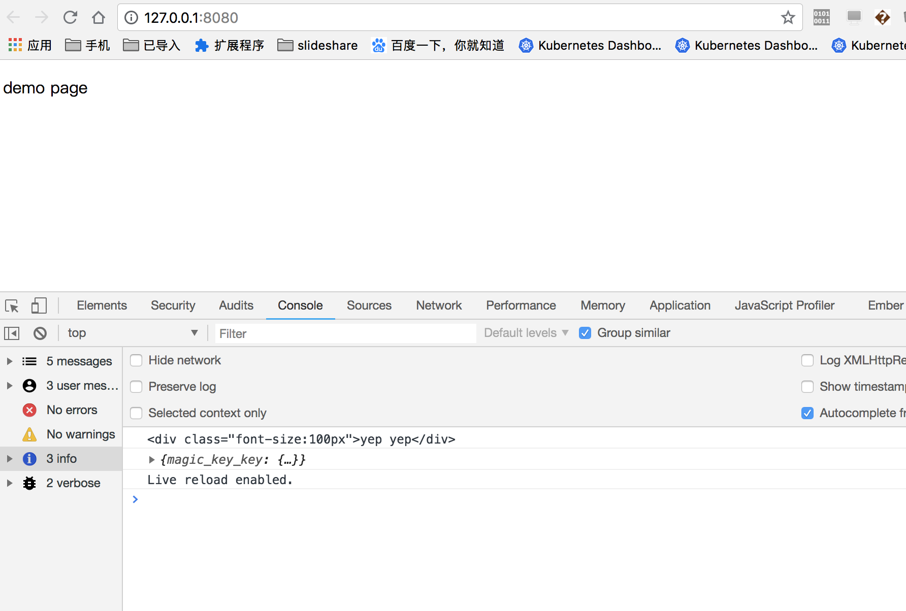

# json patch && json template demo && json schema

> include json-patch && json-t demo   && json-schema

## Run json-patch demo

```code
yarn run p
```

## Run json-t demo

```code
yarn run t
```

## Run json-schema

```code
yarn run s
```

## Run json schema generate

```code
yarn run gs
```

## Run json merge patch

```code
yarn run  m
```

## Browserify build

* build

```code
yarn build
```

* live watch

```code
yarn start
open browser open dev tools
```

## some images

